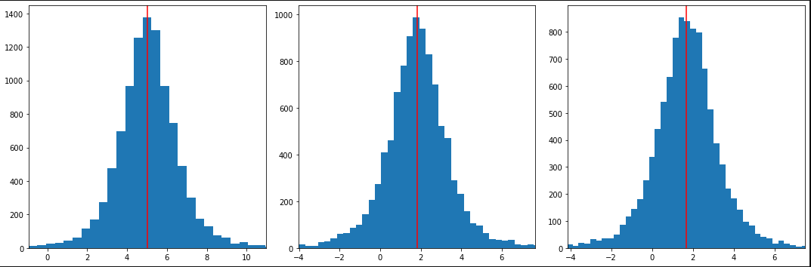

# Bayesian Quantile Regression

A light-weight C++ implementation of Bayesian quantile regression using the asymmetric Laplace density representation of the problem, with bindings/wrappers for Python and R.

# Installation

Clone the library and pull the necessary submodules:

``` bash
# clone optim into the current directory
git clone https://github.com/kthohr/BayesianQuantileRegression ./BayesianQuantileRegression

# change directory
cd ./BayesianQuantileRegression

# clone necessary submodules
git submodule update --init
```

## Python wrapper

If you do not already have Eigen3 and Pybind11, clone and set environment variables:

```bash
# clone Eigen3
git clone https://gitlab.com/libeigen/eigen.git

# clone Pybind11
git clone https://github.com/pybind/pybind11.git

# set environment variables
export EIGEN_INCLUDE_PATH = "<path to this directory>/eigen"
export PYBIND11_INCLUDE_PATH = "<path to this directory>/pybind11/include"
```

```bash
# change directory into the Python subdirectory
cd BayesianQuantileRegression/Python

# install the package
python3 -m pip install . --user
```

## R wrapper

First install the `RcppEigen` package from R:

```R
install.packages("RcppEigen")
```

Then install the package from the `R` subdirectory:

```bash
# change directory into the R subdirectory
cd BayesianQuantileRegression/R

# install the package
R CMD INSTALL .
```

# Example

```python
# import libraries
import numpy as np
import matplotlib.pyplot as plt
from pybqreg import BayesianQuantileRegression

# generate data
n = 500
K = 3

X = np.random.normal(0.0, 1.0, [n, K])
X[:,0] = np.ones(n)

beta0 = np.random.uniform(1.0, 2.0, K)
beta0[0] = 5.0

Y = np.matmul(X, beta0) + np.random.normal(0.0, 1.0, n)

# initialize object
obj = BayesianQuantileRegression(Y,X)

# set prior pars
beta_bar = np.zeros(K)

V0 = np.zeros([K, K])
np.fill_diagonal(V0, 1.0/0.001)

prior_shape = 3
prior_scale = 3

obj.set_prior_params(beta_bar, V0, prior_shape, prior_scale)

# (optional) set the initial draw for beta
beta_hat = np.linalg.solve( np.matmul(X.transpose(),X), np.matmul(X.transpose(),Y) )
obj.set_initial_beta_draw(beta_hat)

# (optional) set the number of OpenMP threads
obj.set_omp_n_threads(4)
obj.get_omp_n_threads()

# (optional) set the seed value of the Gibbs sampler RNG
obj.set_seed_value(1111)

# set the target quantile (tau) and run the Gibbs sampler
tau = 0.5
n_burnin_draws = 10000
n_keep_draws = 10000

beta_draws, z_draws, sigma_draws = obj.fit(tau, n_burnin_draws, n_keep_draws, 0)

beta_mean = np.mean(beta_draws, axis = 1)
beta_std = np.std(beta_draws, axis = 1)

# plot beta draws

fig, axs = plt.subplots(1, 3, figsize=(15, 5), tight_layout=True)

for k in range(3):
    axs[k].hist(beta_draws[k,:], bins = 200)

    axs[k].set_xlim(beta_mean[k] - 3*beta_std[k], beta_mean[k] + 3*beta_std[k])

    axs[k].axvline(beta_mean[k], c = 'r')

plt.show()
```

